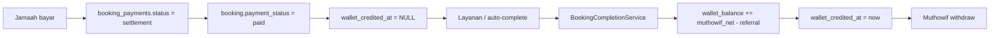
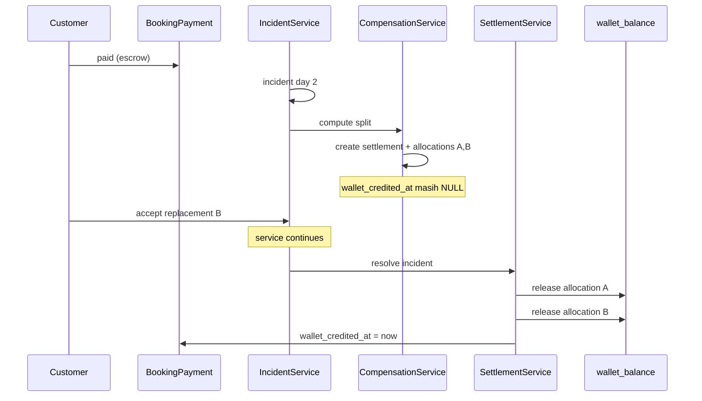
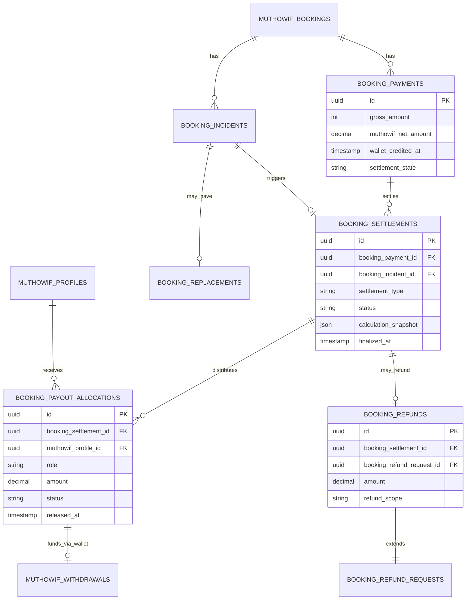
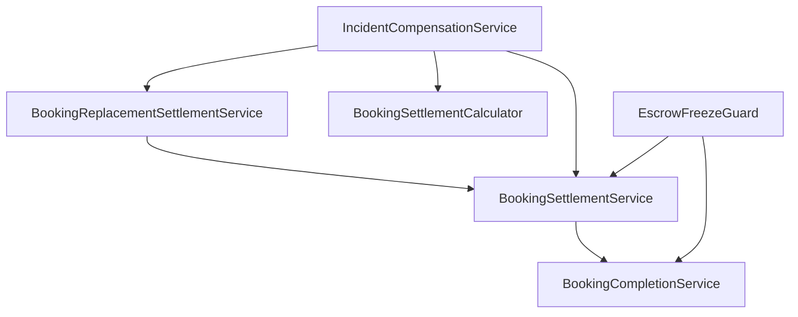
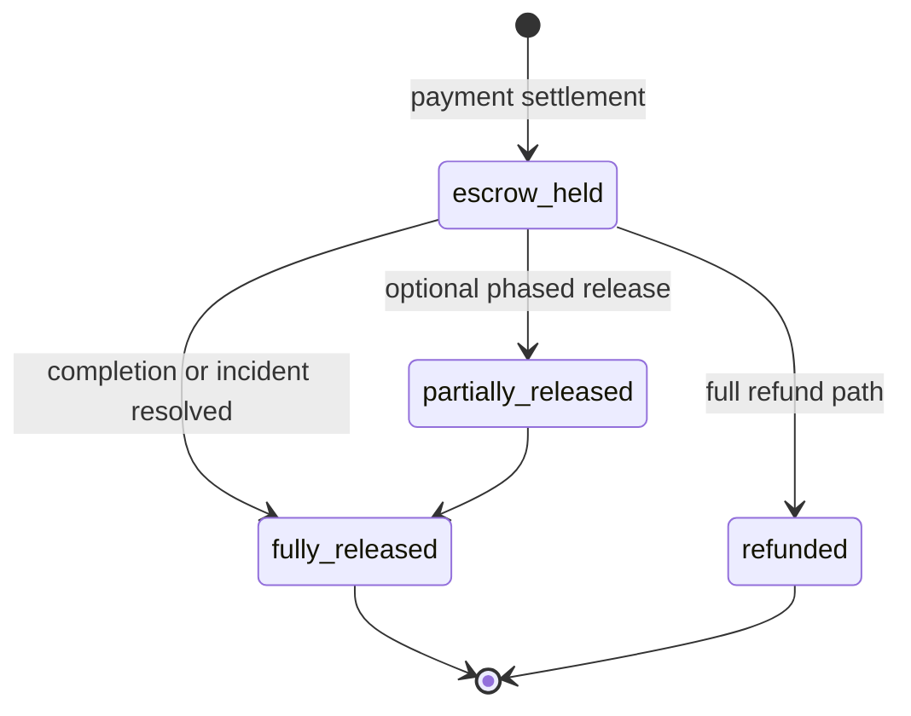
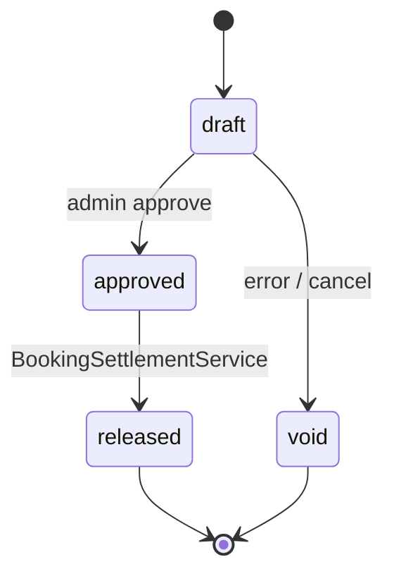
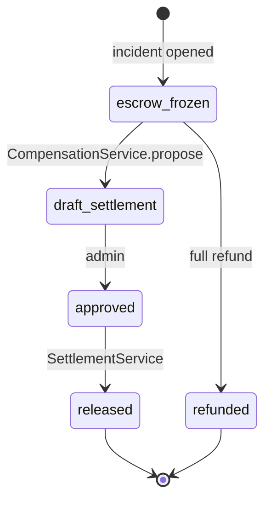
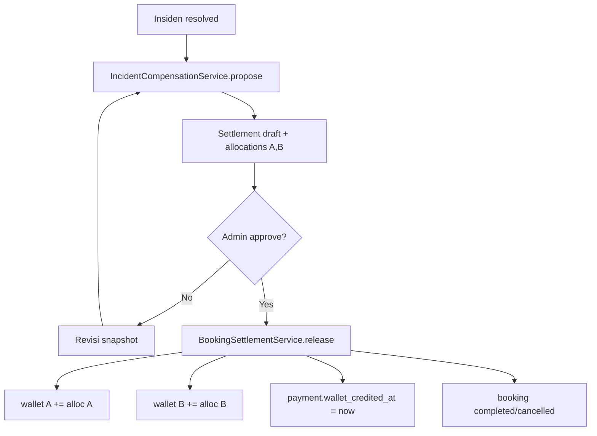
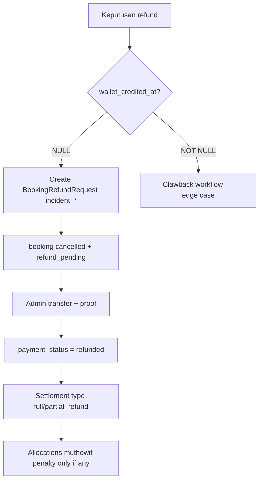
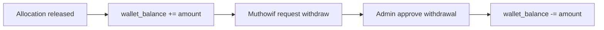

# BaytGo — Escrow, Settlement & Incident Financial Design

Dokumen ini melengkapi [muthowif-incident-response-system.md](./muthowif-incident-response-system.md) dengan fokus **keuangan**: escrow, replacement, refund, dan withdraw untuk kasus:

| Case type | Kode |
|-----------|------|
| Muthowif sakit / berhalangan | `muthowif_unavailable` |
| Hilang kontak saat pendampingan | `lost_contact_in_service` |
| Meninggalkan pendampingan | `abandoned_service` |

**Versi:** 1.0  
**Prinsip:** Dana jamaah yang sudah `paid` dianggap **escrow platform** sampai alokasi payout di-*release* ke `wallet_balance` muthowif. Withdraw existing **tidak diubah** — hanya sumber kredit wallet yang menjadi terkontrol.

---

## Daftar isi

1. [Review model escrow saat ini](#1-review-model-escrow-saat-ini)
2. [Architecture recommendation](#2-architecture-recommendation)
3. [Jawaban pertanyaan settlement](#3-jawaban-pertanyaan-settlement)
4. [Contoh numerik: 5 hari, insiden hari ke-2](#4-contoh-numerik-5-hari-insiden-hari-ke-2)
5. [Replacement flow & pembagian 2 muthowif](#5-replacement-flow--pembagian-2-muthowif)
6. [Business rules](#6-business-rules)
7. [ERD](#7-erd)
8. [Migration Laravel](#8-migration-laravel)
9. [Enum](#9-enum)
10. [Service layer design](#10-service-layer-design)
11. [Diagram](#11-diagram)
12. [Flows: settlement, refund, withdraw](#12-flows-settlement-refund-withdraw)
13. [Edge cases](#13-edge-cases)
14. [Roadmap implementasi](#14-roadmap-implementasi)

---

## 1. Review model escrow saat ini

### 1.1 Alur yang sudah berjalan di kode



| Komponen | File / model | Perilaku |
|----------|--------------|----------|
| Split fee | `PlatformFee::split()` | `base`, `customer_gross`, `muthowif_net`, fee platform |
| Pembayaran | `BookingPayment` | `gross_amount`, `muthowif_net_amount`, `platform_fee_amount` |
| Escrow implisit | `wallet_credited_at IS NULL` | Uang “mengendap” sampai selesai |
| Cair ke dompet | `BookingCompletionService` | Satu kali kredit ke **satu** `muthowif_profile_id` booking |
| Refund jamaah | `BookingRefundExecutor` | Hanya `confirmed` + `paid`; **blokir** jika `wallet_credited_at` sudah ada |
| Fee muthowif saat refund | `BookingRefundController` | `refund_fee_muthowif` (default 1% base) masuk `wallet_balance` |
| Withdraw | `MuthowifWithdrawal` | Debit `wallet_balance` setelah admin approve |

### 1.2 Kekurangan untuk incident + replacement

| Gap | Risiko |
|-----|--------|
| Kredit 100% ke muthowif A saat `completed` | Muthowif bermasalah tetap dapat full net |
| Satu payment → satu muthowif di booking | Replacement B tidak punya jalur payout terpisah |
| Refund hanya full formula self-service | Tidak ada partial refund / prorata hari |
| Tidak ada `freeze` saat insiden | Auto-complete bisa kredit muthowif yang hilang |
| `BookingPeerReferralService` hanya **pending + unpaid** | Paid + replacement tidak tertangani |

### 1.3 Kesimpulan arsitektur

**Jangan** membuat tabel `escrow_accounts` terpisah di fase 1 (duplikasi saldo).  
**Ya** tambahkan **sub-ledger alokasi** pada `booking_payments` + **settlement event** yang mengontrol kapan wallet naik.

---

## 2. Architecture recommendation

### 2.1 Pola: Payment sebagai escrow header, allocation sebagai kebenaran finansial

```
booking_payments (HEADER escrow — sudah ada)
    └── booking_settlements (EVENT — kapan & mengapa diselesaikan)
            └── booking_payout_allocations (BARIS — siapa dapat berapa)
    └── booking_refunds (HEADER refund ke jamaah — perluasan dari booking_refund_requests)
```

| Layer | Tanggung jawab |
|-------|----------------|
| **BookingPayment** | Total dana masuk (gross), muthowif_net snapshot, status gateway |
| **BookingSettlement** | Satu keputusan admin/sistem: `normal_completion`, `incident_split`, `full_refund`, `partial_refund` |
| **BookingPayoutAllocation** | Per penerima: muthowif A, muthowif B, platform, referral; status `pending` → `released` |
| **BookingRefund** | Keluar ke jamaah (link `booking_refund_requests` existing) |
| **BookingCompletionService** | Refactor: panggil `BookingSettlementService` alih-alih kredit langsung |

### 2.2 Evaluasi nama service yang Anda usulkan

| Service | Verdict | Peran |
|---------|---------|-------|
| `BookingSettlementService` | **Tepat** | Orkestrator release escrow, idempotent, satu pintu masuk kredit wallet |
| `IncidentCompensationService` | **Tepat** | Hitung policy: prorata hari, full/partial refund, alokasi A/B dari `case_type` |
| `BookingReplacementSettlementService` | **Tepat sebagai specialist** | Dipanggil oleh `IncidentCompensationService`; buat baris alokasi B + update replacement record |

**Tambahan wajib:**

| Service | Peran |
|---------|-------|
| `EscrowFreezeGuard` | Cek insiden open / settlement belum final → blok complete & blok withdraw dari allocation pending |
| `BookingSettlementCalculator` | Pure function: hari layanan, base, net, referral |

### 2.3 Aturan emas finansial

1. **`wallet_credited_at` pada payment** = semua alokasi `released` dan ∑ allocation = muthowif_net yang boleh ke muthowif (+ referral row terpisah).
2. **Tidak ada kredit wallet** saat `booking.incident_status = open` atau ada alokasi `disputed`.
3. **Satu payment** dapat memiliki **banyak alokasi** muthowif (A + B), tapi ∑ muthowif allocations ≤ `payment.muthowif_net_amount - referral`.
4. **Refund ke jamaah** + **payout muthowif** + **retensi platform** harus ∑ = dana yang bisa dialokasikan dari payment (reconcile).
5. **Withdraw** tetap dari `wallet_balance`; tidak sentuh payment row.

---

## 3. Jawaban pertanyaan settlement

### Kapan dana boleh dicairkan ke muthowif?

| Kondisi | Boleh release? |
|---------|----------------|
| Booking `completed` + tidak ada insiden open + semua hari layanan dikonfirmasi selesai (atau auto-complete tanpa insiden) | Ya — 100% ke muthowif aktif (atau split jika sudah ada keputusan) |
| Insiden `resolved` dengan `replacement_completed` + alokasi disetujui admin | Ya — per baris alokasi |
| Insiden open | **Tidak** |
| `refund_full` diputuskan | Hanya `refund_fee_muthowif` (jika policy) ke A, bukan full net |
| `abandoned_service` terbukti | 0% ke A (atau hanya penalty fee), sisanya B atau refund |

**Trigger release:** `BookingSettlementService::releaseAllocations(BookingSettlement $settlement)`.

### Bagaimana jika terjadi replacement muthowif?

- **Payment tetap satu** (jamaah tidak bayar ulang).
- Buat `booking_replacements` + alokasi:
  - Muthowif A: prorata hari sebelum insiden (jika layanan benar-benar jalan) atau 0% jika `abandoned`.
  - Muthowif B: prorata hari setelah replacement aktif.
- `muthowif_profile_id` pada booking bisa di-update untuk **operasional** (chat, UI), tetapi **payout mengikuti allocation**, bukan field profile saja.

### Layanan berjalan sebagian lalu insiden?

- Hitung `completed_service_days` (check-in, log harian, atau keputusan admin).
- `muthowif_unavailable` + bukti valid: A dapat prorata hari terlayani; sisanya ke B atau refund.
- `lost_contact` / `abandoned`: A dapat 0 atau minimum penalty; prioritaskan refund/pengganti.

### Refund penuh?

- `BookingSettlement` type `full_refund`.
- Alokasi: `customer_refund` = `customer_paid_amount` atau `net_refund` per policy insiden (bisa bypass potongan H-60).
- `wallet_credited_at` tetap NULL untuk muthowif net; `payment_status` → `refund_pending` → `refunded`.
- Extend `BookingRefundRequest` dengan `incident_id`, `refund_type=full`.

### Refund sebagian (partial)?

- `partial_refund` + payout prorata muthowif yang melayani.
- Formula dasar:

```text
service_base       = dari PlatformFee::split(resolvedAmountDue).base
muthowif_pool      = payment.muthowif_net_amount - referral_reward
day_share          = completed_days / total_service_days
muthowif_A         = muthowif_pool * (days_A / total_days) * performance_factor
muthowif_B         = muthowif_pool * (days_B / total_days)
customer_refund    = customer_paid_amount - muthowif_A - muthowif_B - platform_retained
```

- Platform retention: fee sudah terpisah di `platform_fee_amount`; jangan double-charge.

### Dua muthowif, satu booking — pembagian?

| Penerima | Sumber | Masuk withdraw? |
|----------|--------|-----------------|
| Muthowif A | `booking_payout_allocations` beneficiary_profile_id = A | Ya, setelah `released` |
| Muthowif B | allocation row B | Ya |
| Referrer | row `referral` (existing payment fields) | Ya, saat release (sama seperti sekarang) |
| Jamaah | `booking_refunds` / refund request | Transfer bank manual admin |

**Settlement terpisah?** Ya — satu **`booking_settlements`** per keputusan akhir (bisa revisi dengan event audit, tidak double-release).

### Tidak mengganggu withdraw existing?

- `MuthowifWithdrawal` **tidak berubah**.
- Hanya cara **mengisi** `wallet_balance` yang memecah ke N alokasi.
- `MuthowifWalletLedger` perluas: baca dari `booking_payout_allocations.released_at` (bukan hanya `wallet_credited_at` monolitik).

---

## 4. Contoh numerik: 5 hari, insiden hari ke-2

**Asumsi:**

| Item | Nilai |
|------|-------|
| Base layanan | Rp 2.000.000 |
| Customer fee 7,5% | Rp 150.000 |
| **Customer paid (gross)** | **Rp 2.150.000** |
| Muthowif fee 7,5% | Rp 150.000 |
| **Muthowif net pool** | **Rp 1.850.000** |
| Referral | Rp 0 (simpel) |
| Total hari | 5 |
| Insiden | Hari ke-2, replacement B hari ke-2–5 |
| Hari terlayani A | 2 hari (dengan bukti check-in) |
| Hari terlayani B | 3 hari |

**Keputusan policy (replacement berhasil):**

| Pihak | Perhitungan | Nominal |
|-------|-------------|---------|
| Muthowif A | 1.850.000 × 2/5 | Rp 740.000 |
| Muthowif B | 1.850.000 × 3/5 | Rp 1.110.000 |
| Jamaah refund | Opsional goodwill 0 | Rp 0 |
| Platform | Sudah terima fee di gross | — |

**Jika `abandoned_service` (A tidak layani):**

| Pihak | Nominal |
|-------|---------|
| Muthowif A | Rp 0 (atau penalty 1% base = Rp 20.000 ke wallet sesuai refund_fee) |
| Muthowif B | 1.850.000 × 3/5 atau full sisa |
| Jamaah | Partial refund 2/5 × base net formula |

---

## 5. Replacement flow & pembagian 2 muthowif



### Konsep settlement terpisah per muthowif?

**Tidak** dua settlement event terpisah untuk A dan B (rawan double-spend).  
**Ya** satu `booking_settlement` dengan **dua baris alokasi**; release bisa:

- **Sekaligus** saat booking `completed` akhir; atau
- **Bertahap**: A released setelah hari 2 dikonfirmasi admin (opsional fase 2, lebih kompleks).

**Rekomendasi fase 1:** release **sekali** saat insiden `resolved` + booking `completed` / `cancelled` dengan keputusan final.

---

## 6. Business rules

### 6.1 Matriks keputusan

| Skenario | Layanan dimulai? | Replacement | Muthowif A | Muthowif B | Jamaah |
|----------|------------------|-------------|------------|------------|--------|
| Replacement berhasil | Ya | Ya | Prorata hari A | Prorata hari B | Tidak refund wajib |
| Replacement gagal | Ya/Tidak | Tidak | Prorata / 0 | — | Full atau partial refund |
| Sebagian layanan selesai | Ya | Opsional | Prorata terlayani | — | Partial refund sisa |
| Belum dimulai | Tidak | Ya | 0% | 100% pool atau refund penuh | Full refund default |
| Sakit + bukti valid | Belum/sedikit | Ya | 0% penalty | Prorata sisa | Opsional voucher |
| Meninggalkan layanan | Ya | Ya/Refund | 0% | Sisa ke B atau refund | Partial/full |
| Customer minta refund padahal ada pengganti | — | Tersedia | Freeze | Freeze | CS tawarkan B dulu; refund jika tolak B |

### 6.2 Case-specific rules

#### `muthowif_unavailable`

- Bukti disetujui → **tanpa strike** finansial berat; A = 0% jika belum layani.
- Jika sudah 1 hari layani → prorata 1/5.
- B mendapat sisa pool setelah A (jika replacement).

#### `lost_contact_in_service`

- SLA: eskalasi critical.
- A: 0% kecuali admin verifikasi layanan parsial via log/check-in.
- Partial refund jamaah untuk hari tidak terlayani.

#### `abandoned_service`

- A: 0% (atau hanya `refund_fee_muthowif` 1% base sebagai penalty).
- B atau refund: admin pilih dalam 4 jam (critical SLA).

### 6.3 Freeze rules

```php
// Pseudocode
function escrowFrozen(MuthowifBooking $booking): bool {
    return $booking->incident_status === 'open'
        || $booking->settlement_status === 'pending_review';
}
```

- `BookingCompletionService`: return early / no credit if frozen.
- `AutoCompleteBookingsAfterService`: skip frozen bookings.

---

## 7. ERD



### Perbandingan tabel

| Tabel | Perlu? | Alasan |
|-------|--------|--------|
| `booking_settlements` | **Ya** | Event keputusan + snapshot formula |
| `booking_payout_allocations` | **Ya** | Dua muthowif + audit |
| `booking_refunds` | **Opsional** | Bisa cukup perluas `booking_refund_requests`; tambah jika ingin pisah settlement vs operasional transfer |
| `booking_escrow_accounts` | **Tidak fase 1** | Redundan dengan `booking_payments` |

---

## 8. Migration Laravel

### 8.1 `booking_settlements`

```php
Schema::create('booking_settlements', function (Blueprint $table) {
    $table->uuid('id')->primary();
    $table->foreignUuid('muthowif_booking_id')->constrained('muthowif_bookings')->cascadeOnDelete();
    $table->foreignUuid('booking_payment_id')->constrained('booking_payments')->cascadeOnDelete();
    $table->foreignUuid('booking_incident_id')->nullable()->constrained('booking_incidents')->nullOnDelete();
    $table->string('settlement_type', 40); // normal_completion, incident_split, full_refund, partial_refund
    $table->string('status', 30)->default('draft'); // draft, approved, released, void
    $table->json('calculation_snapshot');
    $table->foreignUuid('approved_by_user_id')->nullable()->constrained('users')->nullOnDelete();
    $table->timestamp('approved_at')->nullable();
    $table->timestamp('released_at')->nullable();
    $table->timestamps();

    $table->index(['muthowif_booking_id', 'status']);
    $table->unique(['booking_payment_id', 'status'], 'unique_released_per_payment')->where('status', 'released'); // partial unique — implement via app logic if DB lacks partial unique
});
```

> Catatan: enforce **satu settlement `released` per payment** di service layer (idempotent).

### 8.2 `booking_payout_allocations`

```php
Schema::create('booking_payout_allocations', function (Blueprint $table) {
    $table->uuid('id')->primary();
    $table->foreignUuid('booking_settlement_id')->constrained('booking_settlements')->cascadeOnDelete();
    $table->foreignUuid('muthowif_profile_id')->constrained('muthowif_profiles');
    $table->string('role', 30); // primary, replacement, penalty
    $table->unsignedSmallInteger('service_days')->default(0);
    $table->unsignedSmallInteger('total_service_days')->default(0);
    $table->decimal('amount', 15, 2);
    $table->string('status', 20)->default('pending'); // pending, released, reversed
    $table->timestamp('released_at')->nullable();
    $table->string('wallet_ledger_tie', 64)->nullable();
    $table->timestamps();

    $table->index(['muthowif_profile_id', 'status']);
});
```

### 8.3 Alter `booking_payments`

```php
Schema::table('booking_payments', function (Blueprint $table) {
    $table->string('settlement_state', 30)->default('escrow_held')->after('wallet_credited_at');
    // escrow_held | partially_released | fully_released | refunded
});
```

### 8.4 Alter `booking_refund_requests`

```php
Schema::table('booking_refund_requests', function (Blueprint $table) {
    $table->foreignUuid('booking_incident_id')->nullable()->constrained('booking_incidents')->nullOnDelete();
    $table->foreignUuid('booking_settlement_id')->nullable()->constrained('booking_settlements')->nullOnDelete();
    $table->string('refund_scope', 20)->default('standard'); // standard, incident_full, incident_partial
    $table->unsignedSmallInteger('refund_service_days_credited')->nullable();
});
```

### 8.5 Data migration (existing payments)

```php
// Satu allocation 100% untuk payment yang sudah wallet_credited_at
BookingPayment::whereNotNull('wallet_credited_at')->each(function ($payment) {
    $settlement = BookingSettlement::create([
        'muthowif_booking_id' => $payment->muthowif_booking_id,
        'booking_payment_id' => $payment->id,
        'settlement_type' => 'normal_completion',
        'status' => 'released',
        'calculation_snapshot' => ['migrated' => true],
        'released_at' => $payment->wallet_credited_at,
    ]);
    BookingPayoutAllocation::create([
        'booking_settlement_id' => $settlement->id,
        'muthowif_profile_id' => $payment->muthowifBooking->muthowif_profile_id,
        'role' => 'primary',
        'amount' => $payment->muthowifWalletCreditAmount(),
        'status' => 'released',
        'released_at' => $payment->wallet_credited_at,
    ]);
});
```

---

## 9. Enum

```php
// BookingPaymentSettlementState
enum BookingPaymentSettlementState: string {
    case EscrowHeld = 'escrow_held';
    case PartiallyReleased = 'partially_released';
    case FullyReleased = 'fully_released';
    case Refunded = 'refunded';
}

// BookingSettlementType
enum BookingSettlementType: string {
    case NormalCompletion = 'normal_completion';
    case IncidentSplit = 'incident_split';
    case FullRefund = 'full_refund';
    case PartialRefund = 'partial_refund';
}

// BookingSettlementStatus
enum BookingSettlementStatus: string {
    case Draft = 'draft';
    case Approved = 'approved';
    case Released = 'released';
    case Void = 'void';
}

// PayoutAllocationRole
enum PayoutAllocationRole: string {
    case Primary = 'primary';
    case Replacement = 'replacement';
    case Penalty = 'penalty'; // refund_fee style
}

// PayoutAllocationStatus
enum PayoutAllocationStatus: string {
    case Pending = 'pending';
    case Released = 'released';
    case Reversed = 'reversed';
}

// BookingIncidentCaseType — tambahan
case AbandonedService = 'abandoned_service';
```

---

## 10. Service layer design

### 10.1 Dependency graph



### 10.2 `BookingSettlementCalculator` (pure)

```php
final class BookingSettlementCalculator
{
    /**
     * @return array{
     *   allocations: list<array{profile_id: string, role: PayoutAllocationRole, days: int, amount: float}>,
     *   customer_refund: float,
     *   platform_retained: float,
     *   snapshot: array
     * }
     */
    public function incidentSplit(
        BookingPayment $payment,
        MuthowifBooking $booking,
        int $daysPrimary,
        int $daysReplacement,
        int $totalDays,
        bool $primaryGetsZero = false,
    ): array;
}
```

### 10.3 `IncidentCompensationService`

```php
final class IncidentCompensationService
{
    public function __construct(
        private BookingSettlementCalculator $calculator,
        private BookingReplacementSettlementService $replacementSettlement,
        private BookingSettlementService $settlements,
    ) {}

    public function proposeSettlement(BookingIncident $incident): BookingSettlement;

    public function applyFullRefund(BookingIncident $incident, User $admin): void;

    public function applyPartialRefund(BookingIncident $incident, int $customerRefundAmount, User $admin): void;
}
```

**Tanggung jawab:**

- Map `case_type` → formula (abandoned → primaryGetsZero true).
- Panggil `replacementSettlement` jika ada `booking_replacements`.
- Buat `BookingSettlement` status `draft` untuk review admin.

### 10.4 `BookingReplacementSettlementService`

```php
final class BookingReplacementSettlementService
{
    /** Buat baris alokasi draft untuk muthowif pengganti. */
    public function buildReplacementAllocation(
        BookingSettlement $settlement,
        MuthowifProfile $replacement,
        int $serviceDays,
        float $amount,
    ): BookingPayoutAllocation;
}
```

### 10.5 `BookingSettlementService` (core)

```php
final class BookingSettlementService
{
    /**
     * Idempotent: jika sudah released, return existing.
     */
    public function approveAndRelease(BookingSettlement $settlement, User $admin): void
    {
        DB::transaction(function () use ($settlement, $admin) {
            $settlement->lockForUpdate();
            $payment = $settlement->bookingPayment->lockForUpdate();

            if ($settlement->status === BookingSettlementStatus::Released) {
                return;
            }

            $this->assertReconciliation($settlement, $payment);

            foreach ($settlement->payoutAllocations as $row) {
                $this->creditMuthowifWallet($row);
                $row->update(['status' => 'released', 'released_at' => now()]);
            }

            $payment->update([
                'wallet_credited_at' => now(),
                'settlement_state' => BookingPaymentSettlementState::FullyReleased,
            ]);

            $settlement->update([
                'status' => BookingSettlementStatus::Released,
                'released_at' => now(),
            ]);
        });
    }

    /** Jalur normal: satu muthowif 100%. */
    public function releaseOnCompletion(MuthowifBooking $booking): void;
}
```

### 10.6 Refactor `BookingCompletionService`

```php
// Ganti blok kredit langsung dengan:
if (EscrowFreezeGuard::isFrozen($booking)) {
    return ['completed' => false, 'credited' => false, 'error' => 'Escrow dibekukan karena insiden.'];
}
app(BookingSettlementService::class)->releaseOnCompletion($booking);
```

### 10.7 Jobs & events

| Job / Event | Kapan |
|-------------|-------|
| `ProposeIncidentSettlementJob` | Setelah insiden masuk `investigating` |
| `BookingSettlementReleased` | Setelah release — update wallet summary |
| `NotifyCustomerOfRefundApproved` | existing + link settlement |
| `PreventAutoCompleteWhenIncidentOpen` | scheduler guard |

---

## 11. Diagram

### 11.1 State diagram — payment escrow



### 11.2 State diagram — booking settlement



### 11.3 State diagram — incident financial



---

## 12. Flows: settlement, refund, withdraw

### 12.1 Settlement flow (incident split)



### 12.2 Refund flow



**Integrasi existing:** `BookingRefundExecutor` tetap untuk self-service; tambah `IncidentRefundExecutor` yang **skip** aturan H-60 jika `incident_id` ada.

### 12.3 Withdraw flow (unchanged path)



**Guard:** withdraw amount ≤ `wallet_balance`; ledger bisa tunjukkan allocation `tie` untuk rekonsiliasi.

---

## 13. Edge cases

| # | Edge case | Penanganan |
|---|-----------|------------|
| 1 | Auto-complete saat insiden open | Skip jika `EscrowFreezeGuard` |
| 2 | `wallet_credited_at` sudah terisi sebelum insiden | Clawback manual + `allocation.reversed`; prevent di masa depan dengan freeze |
| 3 | Replacement B gagal setelah A dapat 0 | Full refund sisa escrow; jangan release B |
| 4 | Customer tolak replacement | CS catat → full/partial refund |
| 5 | Dua kali replacement (B lalu C) | Satu settlement; max 2 allocation muthowif + admin override |
| 6 | Referral pada payment | Baris allocation `referral` terpisah; ∑ tidak boleh > net pool |
| 7 | Company customer (no customer fee) | `PlatformFee::split` sudah handle |
| 8 | Partial refund + muthowif payout | `calculation_snapshot` wajib reconcile: paid = refund + ∑alloc + platform |
| 9 | Moota webhook telat saat insiden | Payment settlement tetap; escrow tidak release |
| 10 | Muthowif B withdraw sebelum release | Tidak mungkin jika wallet hanya dari release |
| 11 | Dispute setelah release | Post-mortem manual; `allocation.reversed` + admin adjustment record |
| 12 | Hari layanan: dispute jumlah hari | Admin input `completed_service_days` di settlement snapshot |

---

## 14. Roadmap implementasi

| Fase | Deliverable | Minggu |
|------|-------------|--------|
| **F1** | Migration settlements + allocations; `EscrowFreezeGuard`; refactor `BookingCompletionService` | 1–2 |
| **F2** | `IncidentCompensationService` + admin UI approve settlement | 2–3 |
| **F3** | Replacement + split A/B; extend refund requests | 3–4 |
| **F4** | Ledger UI muthowif; reconcile report admin | 4–5 |

### Checklist integrasi dengan kode existing

- [ ] `BookingRefundExecutor`: cek `EscrowFreezeGuard` + incident path
- [ ] `BookingPeerReferralService`: paid replacement → gunakan settlement, bukan transfer booking
- [ ] `MuthowifWalletLedger`: baca `booking_payout_allocations`
- [ ] `AdminFinanceTimeline`: tampilkan settlement + split
- [ ] `config/incident.php`: prorata rules per `case_type`

---

## Lampiran — Rekonsiliasi formula

Invariant yang harus selalu benar sebelum `release`:

```text
customer_paid_amount
  ≈ platform_fee_retained (sudah di payment.platform_fee_amount)
    + sum(muthowif_allocations)
    + sum(referral_rewards)
    + customer_refund_amount
    + rounding_adjustment
```

`rounding_adjustment` disimpan di `calculation_snapshot` (maks. ±Rp 1–2).

---

*Dokumen ini menjadi acuan implementasi finansial incident BaytGo. Setiap keputusan nominal final tetap memerlukan approval admin dan `policy_version` di snapshot.*
