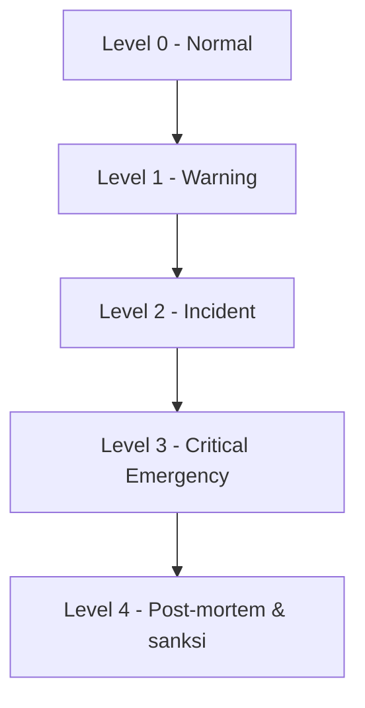
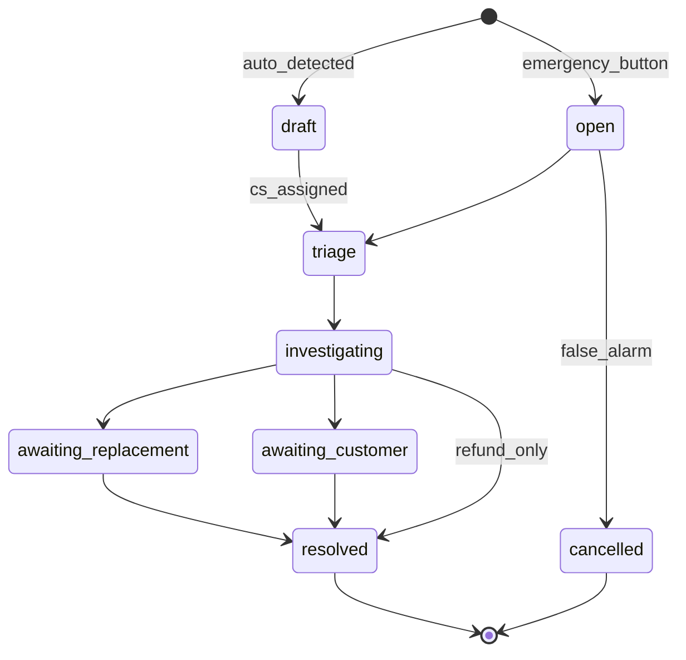
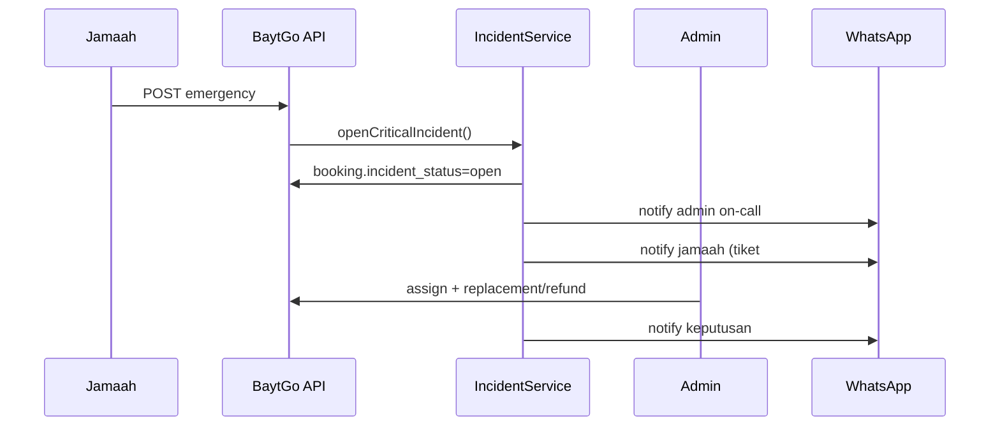

# BaytGo — Sistem Penanganan Insiden Muthowif

Dokumen perancangan untuk worst-case scenario ketika Muthowif bermasalah atau tidak dapat menjalankan pendampingan jamaah umroh/haji.

**Versi:** 1.0  
**Platform:** BaytGo (Laravel 13)  
**Status codebase saat ini:** `Pending` → `Confirmed` → `Completed` / `Cancelled`; refund manual admin; support ticket; peer referral & jaringan referral; chat booking; WA notifikasi.

---

## Daftar isi

1. [Ringkasan eksekutif](#1-ringkasan-eksekutif)
2. [Kondisi sistem saat ini vs gap](#2-kondisi-sistem-saat-ini-vs-gap)
3. [Product Requirement](#3-product-requirement)
4. [Business Process](#4-business-process)
5. [Database Design & ERD](#5-database-design--erd)
6. [Backend Logic](#6-backend-logic)
7. [Notification Flow](#7-notification-flow)
8. [Customer Experience](#8-customer-experience)
9. [Admin Dashboard](#9-admin-dashboard)
10. [Terms & Conditions](#10-terms--conditions)
11. [Risk Mitigation](#11-risk-mitigation)
12. [Audit Trail](#12-audit-trail)
13. [Analisis per case (1–6)](#13-analisis-per-case-16)
14. [Fitur baru yang direkomendasikan](#14-fitur-baru-yang-direkomendasikan)
15. [Enum & status booking](#15-enum--status-booking)
16. [Policy bisnis](#16-policy-bisnis)
17. [Migration Laravel](#17-migration-laravel)
18. [Contoh implementasi service](#18-contoh-implementasi-service)

---

## 1. Ringkasan eksekutif

BaytGo perlu modul **Trust & Safety / Incident Management** terpisah dari alur cancel/refund biasa. Cancel karena jadwal penuh (`jadwal_full`) dan transfer ke muthowif lain (`recommend-peer`) sudah ada, tetapi **tidak mencakup**:

- Deteksi dini (H-1, SLA chat, no-show hari H)
- Eskalasi darurat saat pendampingan berlangsung
- Pengganti muthowif terjamin (replacement) dengan kebijakan kompensasi
- Force majeure dengan bukti & keputusan admin
- Skor risiko muthowif & audit lengkap

**Prinsip desain:**

| Prinsip | Penjelasan |
|--------|------------|
| Jamaah first | Respons < 15 menit untuk insiden kritis hari H |
| Human-in-the-loop | Admin mengesahkan replacement, refund penuh, dan sanksi |
| Otomatisasi hati-hati | Sistem mendeteksi & mengeskalasi, tidak memutuskan kompensasi sendiri |
| Jejak audit | Setiap keputusan tercatat (siapa, kapan, bukti, kebijakan versi) |

---

## 2. Kondisi sistem saat ini vs gap

### Sudah ada

| Area | Implementasi |
|------|----------------|
| Status booking | `pending`, `confirmed`, `completed`, `cancelled` |
| Penolakan muthowif | `muthowif_rejection_kind`: `jadwal_full`, `other` |
| Alih booking (peer) | `BookingPeerReferralService` — hanya **Pending**, belum bayar |
| Rekomendasi jamaah | `MuthowifNetworkReferralService` — setelah **cancelled** |
| Refund | `BookingRefundExecutor` — confirmed + paid, aturan H-X hari |
| Support | `SupportTicket` + kategori `booking` |
| Chat | `BookingChatController` — setelah bayar sampai selesai |
| Notifikasi | Jobs WA (`NotifyCustomerOf*`, `NotifyMuthowifOf*`) |
| Scheduled | `bookings:process-timeouts` (**placeholder kosong**) |

### Gap utama

- Tidak ada status `in_service`, `incident_open`, `replaced`, `no_show`
- Tidak ada SLA respons chat / konfirmasi H-1
- Tidak ada **Emergency Button** jamaah
- Tidak ada entitas **Incident** terpisah dari ticket biasa
- Refund penuh / voucher darurat tidak terpisah dari refund self-service (H-60)
- Tidak ada risk score muthowif
- `bookings:process-timeouts` belum diimplementasi

---

## 3. Product Requirement

### 3.1 Persona

| Persona | Kebutuhan |
|---------|-----------|
| Jamaah | Laporkan masalah cepat, dapat pengganti atau refund jelas, kontak darurat 24/7 |
| Muthowif | Konfirmasi H-1, laporkan force majeure, ajukan pengganti resmi |
| Admin BaytGo | Dashboard insiden, assignment, keputusan kompensasi, sanksi |
| Customer Support | Tiket prioritas tinggi, playbook per case, eskalasi ke admin |

### 3.2 User stories (prioritas)

| ID | Story | Prioritas |
|----|-------|-----------|
| INC-01 | Sebagai jamaah, saya menekan **Emergency** di hari H jika muthowif tidak hadir | P0 |
| INC-02 | Sebagai sistem, saya mengingatkan muthowif konfirmasi H-1 pukul 18:00 WIB | P0 |
| INC-03 | Sebagai admin, saya menugaskan muthowif pengganti dan jamaah menyetujui | P0 |
| INC-04 | Sebagai jamaah, saya melihat status insiden & langkah berikutnya di detail booking | P0 |
| INC-05 | Sebagai admin, saya melihat SLA breach & riwayat insiden per muthowif | P1 |
| INC-06 | Sebagai muthowif, saya melaporkan sakit/force majeure dengan lampiran bukti | P1 |
| INC-07 | Sebagai sistem, saya menaikkan risk score muthowif setelah insiden terbukti | P1 |
| INC-08 | Sebagai jamaah, saya menerima refund penuh jika tidak ada pengganti dalam X jam | P1 |

### 3.3 Non-functional

- Waktu deteksi eskalasi Level 1 → 2: maks. 5 menit (job scheduler 1 menit)
- Notifikasi push/WA kritis: dalam 2 menit setelah insiden `critical` dibuka
- Retensi audit log insiden: minimal 7 tahun (compliance)
- RTO playbook admin: dokumentasi SOP dapat diakses dari dashboard insiden

### 3.4 Out of scope (fase 1)

- Asuransi perjalanan pihak ketiga otomatis
- GPS tracking muthowif real-time
- Call center telepon terintegrasi (CTI) — gunakan klik WA/tel link

---

## 4. Business Process

### 4.1 Model eskalasi (4 level)



| Level | Nama | Pemicu contoh | Owner |
|-------|------|---------------|-------|
| 0 | Normal | Booking confirmed, komunikasi normal | — |
| 1 | Warning | Chat tidak dibalas 4 jam (H-3 s/d H-1) | Sistem + CS |
| 2 | Incident | H-1 tanpa konfirmasi / cancel mendadak H-1 | CS + Admin |
| 3 | Critical | No-show hari H / hilang saat pendampingan | Admin on-call |
| 4 | Penutupan | Investigasi, sanksi, update risk score | Admin + Legal |

### 4.2 SOP operasional BaytGo (ringkas)

1. **Deteksi** — sistem buat `booking_incidents` draft atau auto-open sesuai trigger.
2. **Triase** — CS assign prioritas, hubungi jamaah & muthowif (WA + chat).
3. **Verifikasi** — kumpulkan bukti (screenshot chat, lokasi jamaah, surat RS, dll.).
4. **Resolusi** — salah satu: *replacement*, *refund penuh*, *refund parsial + voucher*, *lanjut dengan muthowif* (salah lapor).
5. **Komunikasi** — notifikasi keputusan ke semua pihak.
6. **Penutupan** — status insiden `resolved`, update risk score, T&C enforcement.

### 4.3 Matriks resolusi (default kebijakan)

| Case | Replacement | Refund penuh | Voucher | Sanksi muthowif |
|------|-------------|--------------|---------|-----------------|
| ~~Tidak respons (pra-H)~~ *(dihapus)* | — | — | — | — |
| No-show H | Ya, darurat | Jika gagal 4 jam | Ya | Strike + suspend |
| Cancel mendadak < 24 jam | Ya | Default jika paid | Ya | Strike berat |
| Cancel < 1 jam | Refund penuh | Ya | Ya | Suspend + review |
| Sakit (bukti valid) | Ya, tanpa strike | Jika gagal | Opsional | Tidak (dengan bukti) |
| Hilang saat layanan | Pengganti + investigasi | Partial/full | Ya | Terminasi jika terbukti |
| Force majeure | Case-by-case | Case-by-case | Opsional | Tidak jika verified |

---

## 5. Database Design & ERD

### 5.1 Entitas baru (ERD tambahan)

```mermaid
erDiagram
    MUTHOWIF_BOOKINGS ||--o{ BOOKING_INCIDENTS : has
    BOOKING_INCIDENTS ||--o{ BOOKING_INCIDENT_EVENTS : logs
    BOOKING_INCIDENTS ||--o| BOOKING_REPLACEMENTS : may_have
    BOOKING_INCIDENTS }o--|| USERS : reported_by
    BOOKING_INCIDENTS }o--o| USERS : assigned_admin
    BOOKING_REPLACEMENTS }o--|| MUTHOWIF_PROFILES : from_profile
    BOOKING_REPLACEMENTS }o--|| MUTHOWIF_PROFILES : to_profile
    MUTHOWIF_PROFILES ||--o| MUTHOWIF_RISK_SCORES : has
    MUTHOWIF_BOOKINGS ||--o{ BOOKING_H1_CONFIRMATIONS : has
    MUTHOWIF_BOOKINGS ||--o{ BOOKING_SLA_CHECKS : has
    BOOKING_INCIDENTS ||--o{ BOOKING_COMPENSATIONS : has
    SUPPORT_TICKETS ||--o| BOOKING_INCIDENTS : linked_optional

    MUTHOWIF_BOOKINGS {
        uuid id PK
        string status
        string incident_status nullable
        datetime service_starts_at
    }

    BOOKING_INCIDENTS {
        uuid id PK
        uuid muthowif_booking_id FK
        string case_type
        string severity
        string status
        string resolution_type nullable
        uuid reported_by_user_id
        uuid assigned_admin_id nullable
        text customer_statement nullable
        json metadata
        timestamp opened_at
        timestamp resolved_at nullable
    }

    BOOKING_INCIDENT_EVENTS {
        uuid id PK
        uuid booking_incident_id FK
        string event_type
        string actor_type
        uuid actor_id nullable
        json payload
        timestamp created_at
    }

    BOOKING_REPLACEMENTS {
        uuid id PK
        uuid booking_incident_id FK
        uuid original_muthowif_profile_id FK
        uuid replacement_muthowif_profile_id FK
        string status
        uuid approved_by_admin_id nullable
        timestamp offered_at
        timestamp accepted_at nullable
    }

    BOOKING_H1_CONFIRMATIONS {
        uuid id PK
        uuid muthowif_booking_id FK
        string status
        timestamp due_at
        timestamp confirmed_at nullable
        text muthowif_note nullable
    }

    MUTHOWIF_RISK_SCORES {
        uuid muthowif_profile_id PK
        int score
        int strike_count
        timestamp last_incident_at nullable
        json factors
    }

    BOOKING_COMPENSATIONS {
        uuid id PK
        uuid booking_incident_id FK
        string type
        decimal amount
        string currency
        string status
        json policy_snapshot
    }
```

### 5.2 Perluasan tabel existing

**`muthowif_bookings`** (kolom tambahan):

| Kolom | Tipe | Keterangan |
|-------|------|------------|
| `incident_status` | string nullable | `none`, `monitoring`, `open`, `resolved` |
| `service_phase` | string | `pre_service`, `in_service`, `post_service` |
| `h1_confirmed_at` | timestamp nullable | Denormalized untuk query cepat |
| `emergency_reported_at` | timestamp nullable | Saat jamaah tekan emergency |

**`support_tickets`** (kolom tambahan):

| Kolom | Tipe |
|-------|------|
| `booking_incident_id` | uuid nullable FK |
| `is_emergency` | boolean default false |

---

## 6. Backend Logic

### 6.1 Komponen arsitektur

```
app/
├── Enums/
│   ├── BookingIncidentCaseType.php
│   ├── BookingIncidentSeverity.php
│   ├── BookingIncidentStatus.php
│   ├── BookingIncidentResolution.php
│   ├── BookingReplacementStatus.php
│   └── BookingServicePhase.php
├── Models/
│   ├── BookingIncident.php
│   ├── BookingIncidentEvent.php
│   ├── BookingReplacement.php
│   ├── BookingH1Confirmation.php
│   └── MuthowifRiskScore.php
├── Services/
│   ├── Incident/
│   │   ├── BookingIncidentService.php      # orchestrator
│   │   ├── IncidentDetectionService.php    # triggers / SLA
│   │   ├── IncidentEscalationService.php
│   │   ├── BookingReplacementService.php   # extends peer referral
│   │   ├── IncidentCompensationService.php
│   │   └── MuthowifRiskScoreService.php
│   └── ...
├── Jobs/
│   ├── DetectUnresponsiveMuthowifJob.php
│   ├── ProcessH1ConfirmationDeadlinesJob.php
│   └── EscalateCriticalIncidentsJob.php
└── Console/Commands/
    └── MonitorBookingSlaCommand.php
```

### 6.2 State machine insiden



### 6.3 Integrasi dengan fitur existing

| Fitur lama | Integrasi insiden |
|------------|-------------------|
| `BookingPeerReferralService` | Dipanggil dari `BookingReplacementService` jika fase `pending`; paid → buat booking baru atau transfer dengan approval admin |
| `MuthowifNetworkReferralService` | Pool kandidat replacement + UI jamaah |
| `BookingRefundExecutor` | `IncidentCompensationService` bypass aturan H-60 untuk insiden `critical` |
| `SupportTicket` | Auto-create tiket `high` + link `booking_incident_id` |
| Laravel Reverb | Event `BookingReplacementPoolUpdated` (`.incident.replacement_pool.updated`) ke channel jamaah, `muthowif.recruitment`, `admin.incidents`; halaman admin **Pantau layanan** (`admin/pantau-layanan`) via `AdminServiceMonitorUpdated` + fragment refresh |

### 6.4 Scheduler (ganti placeholder)

| Command | Interval | Fungsi |
|---------|----------|--------|
| `bookings:monitor-sla` | 5 menit | Chat SLA, H-1 deadline |
| `bookings:process-timeouts` | 5 menit | Payment timeout (existing plan) |
| `incidents:escalate` | 1 menit | Critical tanpa admin > 15 menit |

---

## 7. Notification Flow

### 7.1 Kanal

| Kanal | Kapan |
|-------|-------|
| WhatsApp (Fonnte) | Semua insiden Level 2+ |
| In-app / Reverb | Pool pengganti & status booking (`CustomerBookingUpdated` + `BookingReplacementPoolUpdated`) |
| Email (opsional) | Ringkasan keputusan |
| Push mobile (fase 2) | Emergency & replacement |

### 7.2 Template notifikasi (contoh)

| Event | Penerima | Pesan ringkas |
|-------|----------|---------------|
| `incident.opened` | Admin on-call | `[DARURAT] Booking {code} - {case_type}` |
| `h1.reminder` | Muthowif | Konfirmasi kesiapan besok sebelum 18:00 |
| `h1.missed` | Jamaah + Admin | Muthowif belum konfirmasi H-1 |
| `replacement.offered` | Jamaah | Profil pengganti X — setujui di app |
| `replacement.confirmed` | Muthowif baru + lama | Jadwal dialihkan |
| `incident.resolved_refund` | Jamaah | Refund penuh Rp X diproses |
| `muthowif.strike` | Muthowif | Pelanggaran SLA — strike {n}/3 |

### 7.3 Diagram alur notifikasi Emergency



---

## 8. Customer Experience

### 8.1 Halaman detail booking (tambahan UI)

| Elemen | Deskripsi |
|--------|-----------|
| **Status banner** | `Pendampingan berjalan` / `Insiden ditangani` / `Pengganti ditugaskan` |
| **Tombol Emergency** | Merah, hanya `confirmed` + paid + fase `pre_service`/`in_service`; konfirmasi dialog + optional GPS |
| **Timeline insiden** | Event terbaru: "Admin menghubungi Anda", "Menawarkan Muthowif Budi" |
| **Panel pengganti** | Mirip `referral-network-alternatives` + tombol **Terima / Tolak** |
| **Hotline** | Link WA CS BaytGo (bukan nomor muthowif saja) |

### 8.2 Prinsip UX

- Bahasa sederhana, tidak menyalahkan jamaah
- ETA respon: "Tim BaytGo akan menghubungi dalam 15 menit"
- Jangan sembunyikan opsi refund jika replacement gagal
- Mode offline: tombol emergency tetap kirim jika ada sinyal lemah (queue retry)

### 8.3 Copy contoh (ID)

> **Pendamping belum hadir?**  
> Tekan **Laporkan Darurat** agar tim BaytGo segera mencarikan pengganti atau mengatur refund sesuai kebijakan.

---

## 9. Admin Dashboard

### 9.1 Modul baru: **Insiden & Trust**

| Widget / halaman | Fungsi |
|------------------|--------|
| **Incident Queue** | Filter: severity, case_type, belum assign, hari H hari ini |
| **SLA Monitor** | H-1 belum konfirmasi, chat breach count |
| **Replacement Console** | Cari muthowif tersedia + assign + kirim ke jamaah |
| **Muthowif Risk** | Leaderboard strike, suspend toggle |
| **Compensation** | Approve refund penuh / voucher |
| **Audit viewer** | Timeline `booking_incident_events` per booking |

### 9.2 KPI dashboard

- MTTA (mean time to assign) insiden kritis
- % insiden selesai dengan replacement < 4 jam
- % no-show terbukti per bulan
- Repeat incident rate per muthowif

---

## 10. Terms & Conditions

### 10.1 Klausul yang harus ditambahkan (ringkas)

1. **Definisi Pendampingan** — mulai dari titik temu pertama sesuai itinerary, berakhir saat muthowif menandai selesai di platform.
2. **Kewajiban Muthowif** — respons chat ≤ 4 jam (H-7 s/d H-2), konfirmasi H-1 sebelum jam 18:00 WIB, hadir di lokasi & waktu yang disepakati.
3. **No-show** — muthowif tidak hadir 30 menit setelah waktu pertemuan tanpa komunikasi = pelanggaran berat.
4. **Pembatalan mendadak** — < 24 jam: platform berhak suspend; jamaah berhak pengganti atau refund penuh jika sudah bayar.
5. **Force majeure** — wajib lapor ≤ 2 jam + bukti; platform menawarkan pengganti tanpa penalti muthowif jika bukti diterima.
6. **Emergency button jamaah** — aktivasi dianggap permintaan resolusi resmi; data lokasi & waktu disimpan untuk investigasi.
7. **Batas tanggung jawab** — BaytGo sebagai marketplace; kompensasi maksimum sesuai kebijakan insiden yang berlaku saat kejadian (snapshot di `booking_compensations.policy_snapshot`).
8. **Arbitrasi** — sengketa dilaporkan ≤ 7 hari setelah `completed` / `cancelled`.

### 10.2 Snapshot kebijakan

Saat insiden dibuka, simpan `policy_version` (dari `site_settings`) ke `booking_incidents.metadata` agar keputusan refund konsisten secara hukum.

---

## 11. Risk Mitigation

| Risiko | Dampak | Mitigasi |
|--------|--------|----------|
| Abuse emergency button | Biaya operasional | Rate limit 1x/6 jam; CS verifikasi; penalti jika false alarm berulang |
| Tidak ada muthowif pengganti | Reputasi | Pool referral + muthowif premium on-call contract |
| Dispute refund | Legal | Audit + policy snapshot + bukti chat |
| Data lokasi sensitif | Privasi | Hanya simpan saat emergency; retention 90 hari |
| Admin bottleneck | SLA miss | On-call rotation + eskalasi otomatis Level 3 |
| Muthowif kabur saat layanan | Keselamatan jamaah | Hotline CS; opsi lapor polisi (di luar platform); refund penuh default |

### 11.1 Risk scoring muthowif (formula awal)

```
score = 100
  - (strikes * 15)
  - (open_incidents_last_90d * 5)
  - (avg_chat_response_hours > 4 ? 10 : 0)
  - (h1_miss_count * 20)
  + (completed_bookings > 50 ? 5 : 0)
```

| Score | Aksi |
|-------|------|
| 80–100 | Normal |
| 60–79 | Monitoring |
| 40–59 | Warning + training wajib |
| < 40 | Suspend new bookings |

---

## 12. Audit Trail

### 12.1 Event types (`booking_incident_events.event_type`)

| Event | Actor | Payload contoh |
|-------|-------|----------------|
| `incident.detected` | system | `{ trigger: "h1_deadline_missed" }` |
| `incident.opened` | customer/admin/system | `{ case_type, severity, geo? }` |
| `incident.assigned` | admin | `{ admin_id }` |
| `contact.attempted` | admin/cs | `{ channel: "wa", outcome }` |
| `muthowif.responded` | muthowif | `{ message_id? }` |
| `replacement.offered` | admin | `{ to_profile_id }` |
| `replacement.accepted` | customer | — |
| `compensation.approved` | admin | `{ type, amount, policy_version }` |
| `booking.status_changed` | system | `{ from, to }` |
| `incident.resolved` | admin | `{ resolution_type, note }` |
| `muthowif.strike_applied` | system | `{ strike_count }` |

### 12.2 Retensi

| Data | Retensi |
|------|---------|
| `booking_incident_events` | 7 tahun |
| GPS emergency | 90 hari |
| Chat booking | Mengikuti retensi chat existing |
| Bukti upload insiden | 3 tahun |

### 12.3 Immutable log

Gunakan `append-only` events (no update/delete); koreksi via event `note.amended` dengan referensi event sebelumnya.

---

## 13. Analisis per case (1–6)

### Case 1 — Muthowif tidak merespons sebelum hari H *(dihapus dari produk)*

> **Status:** Tipe insiden `unresponsive_pre_h` tidak lagi dipakai. SLA chat / reminder muthowif bisa tetap operasional lewat CS tanpa membuka insiden otomatis tipe ini.

| Aspek | Detail |
|-------|--------|
| **Alur kejadian** | *(arsip desain)* Booking confirmed + paid → jamaah chat → muthowif tidak balas ≥ 4 jam → CS hubungi manual; tidak ada auto-insiden pra-H |
| **Trigger** | `last_muthowif_chat_at` > 4h AND `starts_on` > today AND `starts_on` <= today+3 |
| **SOP operasional** | CS hubungi WA muthowif & jamaah → 2 jam tanpa respons muthowif → eskalasi admin → tawarkan replacement atau refund jika H < 2 |
| **Sistem otomatis** | Notif reminder muthowif; buka insiden `severity=medium`; suggest replacement candidates |
| **Admin** | Assign insiden; approve replacement/refund |
| **Customer support** | First contact jamaah; dokumentasi |
| **Muthowif** | Warning strike jika terbukti; tidak respons 2x → suspend |
| **Kompensasi jamaah** | Replacement prioritas; jika H-1 gagal → refund penuh (paid) |
| **Status booking** | `confirmed` + `incident_status=open` → `cancelled` atau replacement booking |
| **Notifikasi** | Reminder → warning ke muthowif → insiden ke admin & jamaah |
| **Data DB** | `booking_sla_checks`, `booking_incidents`, chat timestamps |
| **Audit** | `sla.chat_breach`, `contact.attempted`, `incident.opened` |

---

### Case 2 — Muthowif tidak hadir di hari H

| Aspek | Detail |
|-------|--------|
| **Alur kejadian** | Hari H, waktu pertemuan + 30 menit → jamaah tekan Emergency atau CS lapor → insiden `no_show` critical |
| **Trigger** | Emergency button ATAU (scheduled_start + 30m AND no check-in dari muthowif) |
| **SOP** | Admin on-call < 15 menit; hubungi jamaah; cari replacement on-call pool < 4 jam; parallel refund authorization |
| **Sistem otomatis** | Open `severity=critical`; notify on-call; lock muthowif calendar |
| **Admin** | Assign replacement; full refund pre-auth jika pool kosong |
| **CS** | Support jamaah di lokasi; bahasa menenangkan |
| **Muthowif** | Strike + suspend pending investigasi |
| **Kompensasi** | Voucher + refund partial/ full jika layanan tidak jalan; replacement gratis jika ada |
| **Status booking** | `service_phase=in_service` → `incident_open` → `cancelled` atau new booking replacement |
| **Notifikasi** | Critical ke admin; ke jamaah setiap 30 menit update ETA |
| **Data DB** | `emergency_reported_at`, geo, `booking_incidents.case_type=no_show` |
| **Audit** | `incident.opened` (emergency), `replacement.*`, `compensation.*` |

---

### Case 3 — Muthowif membatalkan mendadak

| Sub-case | H-1 | Beberapa jam | < 1 jam |
|----------|-----|--------------|---------|
| **Trigger** | `cancel` by muthowif + `starts_on = tomorrow` | `starts_on = today` + hours_until < 6 | hours_until < 1 |
| **Severity** | high | critical | critical |
| **SOP** | Auto referral network + admin approve replacement | Same + expedite WA jamaah | Refund penuh default + replacement paralel |
| **Sistem** | Extend `muthowif_rejection_kind`: `last_minute_cancel`, `emergency_cancel`; auto incident | | |
| **Muthowif** | Strike 1 / 2 / 3 by tier | | |
| **Kompensasi** | Replacement + voucher 10% | Replacement + voucher 15% | Refund 100% + voucher 20% |
| **Status** | `cancelled` + new pending booking replacement OR `replaced` status on original |
| **Notifikasi** | `NotifyCustomerOfBookingRejectedJadwalFull` extended + incident template |
| **Data** | `muthowif_rejection_kind`, `hours_before_service` computed |
| **Audit** | `booking.cancelled_by_muthowif`, `incident.opened` |

*Catatan:* Saat ini cancel muthowif hanya untuk `pending` (dengan alasan) atau `confirmed` unpaid. **Perlu perluasan** untuk `confirmed` + `paid` dengan insiden wajib.

---

### Case 4 — Muthowif sakit / kendala pribadi

| Aspek | Detail |
|-------|--------|
| **Alur** | Muthowif buka form "Tidak dapat hadir" + upload bukti → insiden `muthowif_unavailable` → admin verifikasi bukti → replacement |
| **Trigger** | Manual muthowif OR admin-created |
| **SOP** | Verifikasi bukti ≤ 4 jam; jika valid tanpa strike; prioritaskan replacement |
| **Sistem** | Status `awaiting_verification`; suggest replacements |
| **Admin** | Approve bukti + replacement |
| **Muthowif** | Tidak strike jika approved force majeure personal |
| **Kompensasi** | Replacement; jamaah dapat opsi voucher kecil |
| **Status** | `confirmed` → incident → replacement booking |
| **Notifikasi** | Ke jamaah: "Pendamping berhalangan, kami sedang mencari pengganti" |
| **Data** | `incident_attachments` (tabel atau JSON metadata) |
| **Audit** | `evidence.uploaded`, `evidence.approved`, `replacement.offered` |

---

### Case 5 — Hilang kontak saat pendampingan berlangsung

| Aspek | Detail |
|-------|--------|
| **Alur** | `service_phase=in_service` → jamaah lapor hilang → critical incident → CS koordinasi lokasi → replacement untuk sisa hari OR refund prorata |
| **Trigger** | Emergency + `in_service` OR chat inactive muthowif > 2h during service dates |
| **SOP** | Utamakan keselamatan jamaah; hotline; dokumentasi; investigasi 24h |
| **Sistem** | Pause `auto-complete-service` untuk booking ini |
| **Admin** | Keputusan prorata refund vs sisa pendampingan |
| **Muthowif** | Suspend immediate; investigasi |
| **Kompensasi** | Prorata berdasarkan hari layanan tersisa |
| **Status** | `in_service` + incident → partial `completed` atau `cancelled` |
| **Notifikasi** | Critical loop |
| **Data** | Daily service log (fase 2), incident statement |
| **Audit** | Lengkap termasuk `welfare.check` |

---

### Case 6 — Force majeure

| Aspek | Detail |
|-------|--------|
| **Alur** | Muthowif/admin lapor FM → bukti → legal review flag → keputusan replacement/refund/defer |
| **Trigger** | Manual `case_type=force_majeure` |
| **Sub-kategori** | `accident`, `hospital`, `detained`, `disaster` |
| **SOP** | Admin + lead verifikasi; dokumentasi eksternal; tidak auto-penalize |
| **Sistem** | Tag metadata `fm_category`; pause SLA strikes |
| **Kompensasi** | Case-by-case matrix di admin |
| **Status** | Fleksibel |
| **Notifikasi** | Template empatik ke jamaah |
| **Data** | `metadata.fm_category`, attachments |
| **Audit** | `force_majeure.claimed`, `force_majeure.verified` |

---

## 14. Fitur baru yang direkomendasikan

| Fitur | Deskripsi | Prioritas |
|-------|-----------|-----------|
| **Emergency Button** | Jamaah lapor darurat + optional GPS + auto critical incident | P0 |
| **H-1 Confirmation** | Muthowif wajib konfirmasi; job reminder & breach | P0 |
| **Replacement Muthowif** | Alur formal pengganti (paid booking) dengan persetujuan jamaah | P0 |
| **Escalation System** | Level 1–4 + on-call admin | P0 |
| **SLA Monitoring** | Chat response, H-1, check-in hari H | P1 |
| **Incident Management** | Entitas insiden + workflow | P0 |
| **Risk Scoring Muthowif** | Strikes + visibility di admin | P1 |
| **Trust & Safety Module** | Dashboard gabungan | P1 |
| **Check-in Muthowif** | Tombol "Saya sudah bertemu jamaah" (hari H) | P2 |
| **On-call Muthowif pool** | Kontrak khusus muthowif siaga | P2 |

---

## 15. Enum & status booking

### 15.1 Enum baru — `BookingIncidentCaseType`

```php
enum BookingIncidentCaseType: string
{
    case MuthowifUnavailable = 'muthowif_unavailable';
    case LostContactInService = 'lost_contact_in_service';
    case AbandonedService = 'abandoned_service';
    case NoShow = 'no_show';
    case LastMinuteCancel = 'last_minute_cancel';
    case ForceMajeure = 'force_majeure';
    case FalseAlarm = 'false_alarm';
}
```

### 15.2 Enum — `BookingIncidentSeverity`

```php
enum BookingIncidentSeverity: string
{
    case Low = 'low';
    case Medium = 'medium';
    case High = 'high';
    case Critical = 'critical';
}
```

### 15.3 Enum — `BookingIncidentStatus`

```php
enum BookingIncidentStatus: string
{
    case Draft = 'draft';
    case Open = 'open';
    case Triage = 'triage';
    case Investigating = 'investigating';
    case AwaitingReplacement = 'awaiting_replacement';
    case AwaitingCustomer = 'awaiting_customer';
    case Resolved = 'resolved';
    case Cancelled = 'cancelled'; // false alarm
}
```

### 15.4 Enum — `BookingIncidentResolution`

```php
enum BookingIncidentResolution: string
{
    case ReplacementCompleted = 'replacement_completed';
    case FullRefund = 'full_refund';
    case PartialRefund = 'partial_refund';
    case VoucherOnly = 'voucher_only';
    case ServiceContinued = 'service_continued';
    case NoAction = 'no_action';
}
```

### 15.5 Enum — `BookingServicePhase`

```php
enum BookingServicePhase: string
{
    case PreService = 'pre_service';
    case InService = 'in_service';
    case PostService = 'post_service';
}
```

### 15.6 Perluasan — `MuthowifBookingMuthowifRejectionKind`

```php
// Tambahan pada enum existing:
case Illness = 'illness';
case ForceMajeure = 'force_majeure';
case LastMinuteCancel = 'last_minute_cancel';
```

### 15.7 Kolom — `incident_status` pada booking (denormalized)

```php
enum BookingIncidentOverlayStatus: string
{
    case None = 'none';
    case Monitoring = 'monitoring';
    case Open = 'open';
    case Resolved = 'resolved';
}
```

### 15.8 Status booking operasional (rekomendasi fase 2)

Pertahankan `BookingStatus` existing; tambah fase layanan terpisah agar tidak breaking:

| `status` (existing) | `service_phase` | `incident_status` |
|---------------------|-----------------|-------------------|
| confirmed | pre_service | none |
| confirmed | in_service | open |
| cancelled | * | resolved |

Opsional fase 3: status `replaced` sebagai relasi ke booking pengganti, bukan enum status utama.

---

## 16. Policy bisnis

### 16.1 `BookingIncidentPolicy` (contoh)

```php
// app/Policies/BookingIncidentPolicy.php

public function reportEmergency(User $user, MuthowifBooking $booking): bool
{
    return $user->isCustomer()
        && (string) $booking->customer_id === (string) $user->id
        && $booking->status === BookingStatus::Confirmed
        && $booking->isPaid()
        && in_array($booking->service_phase, ['pre_service', 'in_service'], true)
        && $booking->incident_status !== 'open';
}

public function confirmH1(User $user, MuthowifBooking $booking): bool
{
    return $user->isMuthowif()
        && $booking->muthowifProfile?->user_id === $user->id
        && $booking->status === BookingStatus::Confirmed
        && $booking->starts_on->isTomorrow(); // atau H-1 window
}

public function manage(User $user): bool
{
    return $user->isAdmin();
}
```

### 16.2 Aturan kompensasi (config)

```php
// config/incident.php
return [
    'chat_response_sla_hours' => 4,
    'h1_confirmation_deadline' => '18:00',
    'no_show_grace_minutes' => 30,
    'replacement_sla_hours' => [
        'critical' => 4,
        'high' => 12,
        'medium' => 24,
    ],
    'emergency_rate_limit_hours' => 6,
    'strikes_before_suspend' => 3,
];
```

---

## 17. Migration Laravel

### 17.1 `booking_incidents`

```php
Schema::create('booking_incidents', function (Blueprint $table) {
    $table->uuid('id')->primary();
    $table->foreignUuid('muthowif_booking_id')->constrained('muthowif_bookings')->cascadeOnDelete();
    $table->string('case_type', 40);
    $table->string('severity', 20);
    $table->string('status', 30)->default('open');
    $table->string('resolution_type', 40)->nullable();
    $table->foreignUuid('reported_by_user_id')->nullable()->constrained('users')->nullOnDelete();
    $table->foreignUuid('assigned_admin_id')->nullable()->constrained('users')->nullOnDelete();
    $table->text('customer_statement')->nullable();
    $table->text('admin_resolution_note')->nullable();
    $table->json('metadata')->nullable();
    $table->string('policy_version', 20)->nullable();
    $table->timestamp('opened_at');
    $table->timestamp('resolved_at')->nullable();
    $table->timestamps();

    $table->index(['status', 'severity']);
    $table->index(['muthowif_booking_id', 'status']);
});
```

### 17.2 `booking_incident_events`

```php
Schema::create('booking_incident_events', function (Blueprint $table) {
    $table->uuid('id')->primary();
    $table->foreignUuid('booking_incident_id')->constrained('booking_incidents')->cascadeOnDelete();
    $table->string('event_type', 60);
    $table->string('actor_type', 20); // system, customer, muthowif, admin, cs
    $table->uuid('actor_id')->nullable();
    $table->json('payload')->nullable();
    $table->timestamp('created_at');

    $table->index(['booking_incident_id', 'created_at']);
});
```

### 17.3 `booking_replacements`

```php
Schema::create('booking_replacements', function (Blueprint $table) {
    $table->uuid('id')->primary();
    $table->foreignUuid('booking_incident_id')->constrained('booking_incidents')->cascadeOnDelete();
    $table->foreignUuid('original_muthowif_profile_id')->constrained('muthowif_profiles');
    $table->foreignUuid('replacement_muthowif_profile_id')->constrained('muthowif_profiles');
    $table->foreignUuid('replacement_booking_id')->nullable()->constrained('muthowif_bookings')->nullOnDelete();
    $table->string('status', 30)->default('offered');
    $table->foreignUuid('approved_by_admin_id')->nullable()->constrained('users')->nullOnDelete();
    $table->timestamp('offered_at');
    $table->timestamp('customer_accepted_at')->nullable();
    $table->timestamps();
});
```

### 17.4 `booking_h1_confirmations`

```php
Schema::create('booking_h1_confirmations', function (Blueprint $table) {
    $table->uuid('id')->primary();
    $table->foreignUuid('muthowif_booking_id')->unique()->constrained('muthowif_bookings')->cascadeOnDelete();
    $table->string('status', 20)->default('pending');
    $table->timestamp('due_at');
    $table->timestamp('confirmed_at')->nullable();
    $table->text('muthowif_note')->nullable();
    $table->timestamps();
});
```

### 17.5 `muthowif_risk_scores`

```php
Schema::create('muthowif_risk_scores', function (Blueprint $table) {
    $table->foreignUuid('muthowif_profile_id')->primary()->constrained('muthowif_profiles')->cascadeOnDelete();
    $table->unsignedSmallInteger('score')->default(100);
    $table->unsignedSmallInteger('strike_count')->default(0);
    $table->timestamp('last_incident_at')->nullable();
    $table->boolean('suspended')->default(false);
    $table->json('factors')->nullable();
    $table->timestamps();
});
```

### 17.6 Alter `muthowif_bookings`

```php
Schema::table('muthowif_bookings', function (Blueprint $table) {
    $table->string('incident_status', 20)->default('none')->after('status');
    $table->string('service_phase', 20)->default('pre_service')->after('incident_status');
    $table->timestamp('h1_confirmed_at')->nullable();
    $table->timestamp('emergency_reported_at')->nullable();
    $table->timestamp('muthowif_checked_in_at')->nullable();
});
```

### 17.7 Alter `support_tickets`

```php
Schema::table('support_tickets', function (Blueprint $table) {
    $table->foreignUuid('booking_incident_id')->nullable()->constrained('booking_incidents')->nullOnDelete();
    $table->boolean('is_emergency')->default(false);
});
```

---

## 18. Contoh implementasi service

### 18.1 `BookingIncidentService` (orchestrator)

```php
<?php

namespace App\Services\Incident;

use App\Enums\BookingIncidentCaseType;
use App\Enums\BookingIncidentSeverity;
use App\Enums\BookingIncidentStatus;
use App\Enums\BookingStatus;
use App\Jobs\NotifyAdminOfCriticalIncident;
use App\Jobs\NotifyCustomerOfIncidentOpened;
use App\Models\BookingIncident;
use App\Models\BookingIncidentEvent;
use App\Models\MuthowifBooking;
use App\Models\User;
use Illuminate\Support\Facades\DB;
use Illuminate\Validation\ValidationException;

final class BookingIncidentService
{
    public function __construct(
        private readonly IncidentEscalationService $escalation,
        private readonly MuthowifRiskScoreService $riskScore,
    ) {}

    public function openFromEmergency(
        MuthowifBooking $booking,
        User $customer,
        ?string $statement = null,
        ?array $geo = null,
    ): BookingIncident {
        $this->assertCanReportEmergency($booking, $customer);

        return DB::transaction(function () use ($booking, $customer, $statement, $geo) {
            $booking->refresh()->lockForUpdate();

            $caseType = $this->inferCaseType($booking);
            $severity = $caseType === BookingIncidentCaseType::NoShow
                ? BookingIncidentSeverity::Critical
                : BookingIncidentSeverity::High;

            $incident = BookingIncident::query()->create([
                'muthowif_booking_id' => $booking->getKey(),
                'case_type' => $caseType,
                'severity' => $severity,
                'status' => BookingIncidentStatus::Open,
                'reported_by_user_id' => $customer->getKey(),
                'customer_statement' => $statement,
                'metadata' => array_filter([
                    'geo' => $geo,
                    'policy_version' => config('incident.policy_version', '2026-06'),
                ]),
                'policy_version' => config('incident.policy_version', '2026-06'),
                'opened_at' => now(),
            ]);

            $booking->update([
                'incident_status' => 'open',
                'emergency_reported_at' => now(),
            ]);

            $this->logEvent($incident, 'incident.opened', 'customer', $customer->getKey(), [
                'case_type' => $caseType->value,
                'severity' => $severity->value,
            ]);

            $this->escalation->handle($incident);

            if ($severity === BookingIncidentSeverity::Critical) {
                NotifyAdminOfCriticalIncident::dispatchAfterResponse((string) $incident->getKey());
            }
            NotifyCustomerOfIncidentOpened::dispatchAfterResponse((string) $incident->getKey());

            return $incident;
        });
    }

    public function openFromMuthowifCancel(
        MuthowifBooking $booking,
        User $muthowifUser,
        string $rejectionKind,
        int $hoursBeforeService,
    ): BookingIncident {
        $severity = match (true) {
            $hoursBeforeService < 1 => BookingIncidentSeverity::Critical,
            $hoursBeforeService < 6 => BookingIncidentSeverity::Critical,
            $hoursBeforeService < 24 => BookingIncidentSeverity::High,
            default => BookingIncidentSeverity::Medium,
        };

        return DB::transaction(function () use ($booking, $muthowifUser, $rejectionKind, $severity, $hoursBeforeService) {
            $incident = BookingIncident::query()->create([
                'muthowif_booking_id' => $booking->getKey(),
                'case_type' => BookingIncidentCaseType::LastMinuteCancel,
                'severity' => $severity,
                'status' => BookingIncidentStatus::Triage,
                'reported_by_user_id' => $muthowifUser->getKey(),
                'metadata' => [
                    'rejection_kind' => $rejectionKind,
                    'hours_before_service' => $hoursBeforeService,
                ],
                'opened_at' => now(),
            ]);

            $booking->update(['incident_status' => 'open']);

            $this->logEvent($incident, 'incident.detected', 'muthowif', $muthowifUser->getKey(), [
                'trigger' => 'muthowif_cancel',
            ]);

            $this->riskScore->addStrike($booking->muthowifProfile, 'last_minute_cancel');

            return $incident;
        });
    }

    private function inferCaseType(MuthowifBooking $booking): BookingIncidentCaseType
    {
        if ($booking->service_phase === 'in_service') {
            return BookingIncidentCaseType::LostContactInService;
        }
        if ($booking->starts_on->isToday()) {
            return BookingIncidentCaseType::NoShow;
        }

        return BookingIncidentCaseType::LostContactInService;
    }

    private function assertCanReportEmergency(MuthowifBooking $booking, User $customer): void
    {
        if ((string) $booking->customer_id !== (string) $customer->id) {
            throw ValidationException::withMessages(['booking' => 'Unauthorized.']);
        }
        if ($booking->status !== BookingStatus::Confirmed || ! $booking->isPaid()) {
            throw ValidationException::withMessages(['booking' => 'Emergency tidak tersedia untuk status ini.']);
        }
        if ($booking->incident_status === 'open') {
            throw ValidationException::withMessages(['booking' => 'Insiden sudah dilaporkan.']);
        }
    }

    private function logEvent(
        BookingIncident $incident,
        string $type,
        string $actorType,
        ?string $actorId,
        array $payload = [],
    ): void {
        BookingIncidentEvent::query()->create([
            'booking_incident_id' => $incident->getKey(),
            'event_type' => $type,
            'actor_type' => $actorType,
            'actor_id' => $actorId,
            'payload' => $payload,
            'created_at' => now(),
        ]);
    }
}
```

### 18.2 `IncidentDetectionService` (scheduler)

```php
<?php

namespace App\Services\Incident;

use App\Models\MuthowifBooking;
use App\Enums\BookingStatus;
use Carbon\Carbon;

final class IncidentDetectionService
{
    public function detectH1Missed(): int
    {
        $count = 0;
        $deadline = Carbon::today()->setTimeFromTimeString(config('incident.h1_deadline', '18:00:00'));

        if (now()->lt($deadline)) {
            return 0;
        }

        MuthowifBooking::query()
            ->where('status', BookingStatus::Confirmed)
            ->whereDate('starts_on', now()->addDay()->toDateString())
            ->whereNull('h1_confirmed_at')
            ->where('incident_status', 'none')
            ->chunkById(50, function ($bookings) use (&$count) {
                foreach ($bookings as $booking) {
                    app(BookingIncidentService::class)->openFromH1Missed($booking);
                    $count++;
                }
            });

        return $count;
    }

    public function detectChatSlaBreaches(): int
    {
        // Implementasi: query booking_chat_messages terakhir dari customer
        // jika > config('incident.chat_response_sla_hours') tanpa balasan muthowif
        return 0;
    }
}
```

### 18.3 `BookingReplacementService` (paid booking)

```php
<?php

namespace App\Services\Incident;

use App\Models\BookingIncident;
use App\Models\BookingReplacement;
use App\Models\MuthowifProfile;
use App\Services\BookingPeerReferralService;
use App\Services\MuthowifNetworkReferralService;

final class BookingReplacementService
{
    public function offerReplacement(
        BookingIncident $incident,
        MuthowifProfile $target,
        string $adminUserId,
    ): BookingReplacement {
        $booking = $incident->muthowifBooking;

        // Pending + unpaid: reuse BookingPeerReferralService::transfer()
        // Confirmed + paid: buat BookingReplacement record + persetujuan jamaah
        //   (transfer kompleks — admin may create linked booking nanti)

        $replacement = BookingReplacement::query()->create([
            'booking_incident_id' => $incident->getKey(),
            'original_muthowif_profile_id' => $booking->muthowif_profile_id,
            'replacement_muthowif_profile_id' => $target->getKey(),
            'status' => 'offered',
            'approved_by_admin_id' => $adminUserId,
            'offered_at' => now(),
        ]);

        $incident->update(['status' => 'awaiting_replacement']);

        return $replacement;
    }

    /** @return \Illuminate\Support\Collection<int, MuthowifProfile> */
    public function candidatePool(BookingIncident $incident): \Illuminate\Support\Collection
    {
        $booking = $incident->muthowifBooking;

        return app(MuthowifNetworkReferralService::class)
            ->alternativesForCustomerAfterJadwalRejection($booking)
            ->whenEmpty(fn () => app(BookingPeerReferralService::class)
                ->listCandidates($booking, $booking->muthowifProfile));
    }
}
```

---

## Roadmap implementasi

| Fase | Durasi estimasi | Deliverable |
|------|-----------------|-------------|
| **Fase 1** | 3–4 minggu | Migration, enums, `BookingIncidentService`, Emergency API, admin queue dasar, H-1 job |
| **Fase 2** | 2–3 minggu | Replacement paid flow, compensation admin, risk score |
| **Fase 3** | 2 minggu | SLA dashboard, check-in muthowif, mobile emergency |

---

## Lampiran — Mapping ke kode BaytGo existing

| Dokumen ini | File / service existing |
|-------------|-------------------------|
| Cancel + alasan | `Muthowif\BookingController::cancel`, `MuthowifBookingMuthowifRejectionKind` |
| Peer transfer | `BookingPeerReferralService` |
| Referral UI jamaah | `MuthowifNetworkReferralService`, `referral-network-alternatives.blade.php` |
| Refund | `BookingRefundExecutor`, `BookingPostPayRules` |
| Support | `SupportTicket`, `SupportTicketsController` |
| Chat | `BookingChatController` |
| Scheduler placeholder | `ProcessBookingTimeouts` → ganti dengan `MonitorBookingSlaCommand` |

---

*Dokumen ini menjadi acuan product, engineering, operasional, dan legal BaytGo. Revisi berikutnya: versi kebijakan kompensasi angka (Rp/voucher) disetujui manajemen.*
